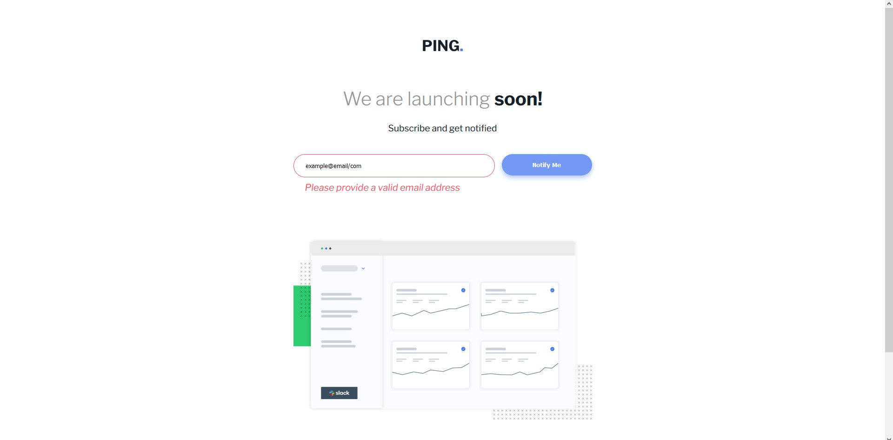

# Frontend Mentor - Ping coming soon page solution

This is a solution to the [Ping coming soon page challenge on Frontend Mentor](https://www.frontendmentor.io/challenges/ping-single-column-coming-soon-page-5cadd051fec04111f7b848da). Frontend Mentor challenges help you improve your coding skills by building realistic projects. 

## Table of contents

- [Overview](#overview)
  - [The challenge](#the-challenge)
  - [Screenshot](#screenshot)
  - [Links](#links)
- [My process](#my-process)
  - [Built with](#built-with)
  - [What I learned](#what-i-learned)
  - [Continued development](#continued-development)
  - [Useful resources](#useful-resources)
- [Author](#author)

## Overview

### The challenge

Users should be able to:

- View the optimal layout for the site depending on their device's screen size
- See hover states for all interactive elements on the page
- Submit their email address using an `input` field
- Receive an error message when the `form` is submitted if:
	- The `input` field is empty. The message for this error should say *"Whoops! It looks like you forgot to add your email"*
	- The email address is not formatted correctly (i.e. a correct email address should have this structure: `name@host.tld`). The message for this error should say *"Please provide a valid email address"*

### Screenshot



### Links

- Solution URL: [Add solution URL here](https://your-solution-url.com)
- Live Site URL: [Add live site URL here](https://your-live-site-url.com)

## My process

### Built with

- Semantic HTML5 markup
- SCSS custom properties
- Flexbox
- Mobile-first workflow
- [jQuery](https://jquery.com/) - For form validation and basic functionality

**Note: These are just examples. Delete this note and replace the list above with your own choices**

### What I learned

I'm not a beginner, but I am rusty. This was a good refresher. I used this project to practice my JS skills, and tried my best to make a clean and optimized code. I was able to streamline an if/else if statement, and a function down to two lines in just one function. and reduced redundant code.

```js
        if (showError) {
            $errorMessageWeb.toggle(isWideScreen);
            $errorMessageMobile.toggle(!isWideScreen);
        }
```
``` js
function validateEmail(email) {
        const emailRegex = /^[^\s@]+@[^\s@]+\.[^\s@]+$/;
        if (email === '') {
            return { showError: true, errorText: 'Email address is required' };
        }
        return emailRegex.test(email)
            ? { showError: false, errorText: '' }
            : { showError: true, errorText: 'Please provide a valid email address' };
    }
```
also found and fixed a bug where a variable returned the wrong value, but because of it I was able to find the true method of returning the correct screen width wile discovering all the other similar js methods.

``` js
  window.innerWidth >= 1440
```
### Continued development

I would like to continue to work on my JS skills, and continue to make my code more efficient and clean. to ensure speed, efficiency, and scalability.

### Useful resources

- [jQuery](https://jquery.com/) - This helped me reduce the time it would take to write basic code dramaticaly.
- [scss](https://sass-lang.com/) - This helped me write more efficient and cleaner css, but I forgot to create variables and mixins which I will use in the future.

## Author

- Website - [Ruildo Docarmo Lobo](https://ruildodcl.ca/)
- Frontend Mentor - [@yourusername](https://www.frontendmentor.io/profile/mcMoffin)
